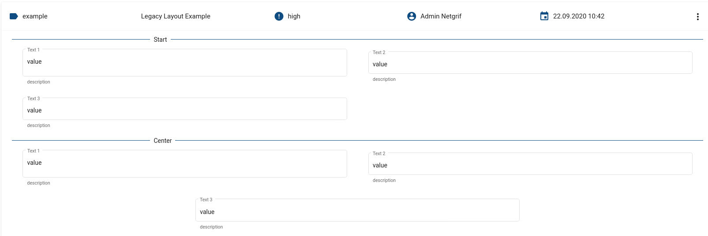

# Form Layouts

The application engine supports 3 layouting algorithms. Each transition and each data group can use a different
algorithm. If no algorithm is specified the `legacy` algorithm will be used.

The following section contains the XML specification of the various layout properties on various layout related
elements.

## Transition

<!-- panels:start -->
<!-- div:left-panel -->

- **cols** - determines the default number of columns for the data groups contained in this task. If no value is
  specified the number of columns is set to 4.
- **rows** - defines a maximum number of rows that can be displayed ad the same time, effectively limiting the task view
  port to a specific height. If the task contains more rows a scroll bar will be displayed. If omitted the maximum
  number of rows is unbounded.
- **offset** - configures the side offset of all data fields from the side of their designated space in the task. This
  offset is added to the individual offset of each field that they may or may not define. If not specified the offset is
    0.
- **fieldAlignment** - determines the default alignment of fields within their designated space. Allowed values
  are `top`, `center` and `bottom`. If not specified, `center` is used
- **hideEmptyRows** - configures the rule for hiding empty rows for all data groups. Only affects the `grid` layout.
  Allowed values are `all`, `compacted` and `none`. If not specified, `all` is used
- **compactDirection** - configures the behavior of the field compacting algorithm for all data groups. Only affects
  the `grid` layout. Allowed values are `none` and `up`. If not specified, `none` is used
- **type** attribute - determines the default layouting algorithm for the data groups contained in this task. Allowed
  values are `legacy`, `flow` and `grid`. If not specified, `grid` is used

<!-- div:right-panel -->

#### XSD Schema

```xml

<xs:element name="layout">
  <xs:complexType>
    <xs:sequence>
      <xs:element ref="cols" minOccurs="0"/>
      <xs:element ref="rows" minOccurs="0"/>
      <xs:element ref="offset" minOccurs="0"/>
      <xs:element name="fieldAlignment" type="fieldAlignment" minOccurs="0"/>
      <xs:element ref="hideEmptyRows" minOccurs="0"/>
      <xs:element ref="compactDirection" minOccurs="0"/>
    </xs:sequence>
    <xs:attribute name="type" type="layoutType"/>
  </xs:complexType>
</xs:element>
```

#### Example

```xml

<transition>
  <layout type="legacy">
    <cols>4</cols>
    <fieldAlignment>center</fieldAlignment>
  </layout>
</transition>
```

<!-- panels:end -->

## Data Group

<!-- panels:start -->
<!-- div:left-panel -->

- **title** - the title of the data group. If not present, nothing is displayed. If present but with an empty value, a
  continuous line will be displayed above the first field in the group. If a non-empty value is set, the value is
  displayed with a line above the first field in the group.
- **cols** - the number of columns of the data group
- **rows** - _currently does nothing_
- **layout** - determines the layouting algorithm of the data group. If none is specified, the parent tasks algorithm
  will be used. Allowed values are `legacy`, `flow` and `grid`
- **alignment** - determines where should fields be placed if they cannot fill the entire row. Only affects the `lagacy`
  and `flow` layouts. The allowed values are `start`, `center` and `end`. If not specified `start` is used
- **stretch** - determines whether the data fields should be stretched to fill the entire row. Only affects the `lagacy`
  and `flow` layouts. If not specified `false` is used
- **hideEmptyRows** - configures the rule for hiding empty rows for all data groups. Only affects the `grid` layout.
  Allowed values are `all`, `compacted` and `none`
- **compactDirection** - configures the behavior of the field compacting algorithm for all data groups. Only affects
  the `grid` layout. Allowed values are `none` and `up`

<!-- div:right-panel -->

#### XSD Schema

```xml

<xs:element name="dataGroup">
  <xs:complexType>
    <xs:sequence>
      <xs:element ref="id"/>
      <xs:element ref="cols" minOccurs="0"/>
      <xs:element ref="rows" minOccurs="0"/>
      <xs:element name="layout" type="layoutType"/>
      <xs:element ref="title" minOccurs="0"/>
      <xs:element ref="alignment" minOccurs="0"/>
      <xs:element ref="stretch" minOccurs="0"/>
      <xs:element ref="hideEmptyRows" minOccurs="0"/>
      <xs:element ref="compactDirection" minOccurs="0"/>
      <xs:element ref="dataRef" maxOccurs="unbounded" minOccurs="0"/>
    </xs:sequence>
  </xs:complexType>
</xs:element>
```

#### Example

```xml

<dataGroup>
  <cols>3</cols>
  <layout>flow</layout>
  <alignment>start</alignment>
  <stretch>true</stretch>
</dataGroup>
```

<!-- panels:end -->

## Data Ref

<!-- panels:start -->
<!-- div:left-panel -->

- **x** - coordinate of the column which is occupied by the top-left corner of the field. The left most column has value 0. 
Only affects the `grid` layout
- **y** - coordinate of the row which is occupied by the top-left corner of the field. The first row has value 0. Only
  affects the `grid` layout
- **rows** - determines how many rows are occupied by the data field (its height). Only affects the `grid` layout
- **cols** - determines how many columns are occupied by the data field (its width). Only affects the `grid` layout
- **offset** - configures the offset of the data field form the side of the space designated for it. Is added to the
  offset defined in the transition
- **template** - determines the display template used by the fields. If not specified `material` is used. The available
  options are:
    - `material` - most of the available space is occupied by the input, with the field title above it
    - `netgrif` - the available space is split in half vertically. The field title is displayed in the left half, the
      input is displayed in the right half. If the total available width is too small `material` template is used
      regardless of the setting.
- **appearance** - determines the appearance of the input according to Material Design. Affects only those data fields
  that contain input elements (for example boolean fields are not affected). Allowed values are `standard`, `outline`
  , `fill` and `legacy`. If not specified `outline` is used
- **alignment** - overrides the **fieldAlignment** setting from the transition. Allowed values are `top`, `center`
  and `bottom`

<!-- div:right-panel -->

#### XSD Schema

```xml

<xs:element name="dataRef">
  <xs:complexType>
    <xs:sequence>
      <xs:element ref="id"/>
      <xs:element ref="logic"/>
      <xs:element ref="layout" minOccurs="0"/>
    </xs:sequence>
  </xs:complexType>
</xs:element>

<xs:element name="layout">
<xs:complexType>
  <xs:sequence>
    <xs:element ref="x"/>
    <xs:element ref="y"/>
    <xs:element ref="rows"/>
    <xs:element ref="cols"/>
    <xs:element ref="offset"/>
    <xs:element ref="template" minOccurs="0"/>
    <xs:element ref="appearance" minOccurs="0"/>
    <xs:element name="alignment" type="fieldAlignment" minOccurs="0"/>
  </xs:sequence>
</xs:complexType>
</xs:element>
```

#### Example

```xml

<dataRef>
  <layout>
    <x>2</x>
    <y>2</y>
    <rows>1</rows>
    <cols>2</cols>
    <template>material</template>
    <appearance>outline</appearance>
  </layout>
</dataRef>
```

<!-- panels:end -->

## Layout mechanics

This section contains the general rules for the computation of the final layout. Examples of each layout are available
in the following sections.

All layouting algorithms operate in a grid, the algorithm affects only how the fields placed into it. The rows of the
grid stretch to accommodate the highest element inside them. If a field that takes multiple rows requires more space,
all of its rows are stretched evenly. The `legacy` and `flow` algorithms don't support empty rows in their layouts.
The `grid` layout can be configured to keep empty rows in the final layout.

Each data group is an independent layouting unit. Data groups have independent coordinate systems. The data groups are
then displayed one under the other in the correct order to achieve the final layout of the task.

All data refs that are not contained in data groups are added to a "virtual" data group at the end of the task. This
data group has the `legacy` layout and the `stretch` property set to `true`. Creating references without data groups is
impossible without modifying the XML generated by the builder by hand.

A data group with no visible fields is hidden and does not display its title. A data group that has at least one of its
fields visible display its title (if set).

If the `grid` layout is used and two or more elements are designated to occupy the same coordinate an error is thrown.
The error contains the identifiers of the overlapping fields, as well as, the overlapping coordinate. The displayed IDs
don't completely follow the IDs declared in the process, but remove special character and may contain variations that
assure their uniqueness within the grid.

## Legacy layout

The legacy layout behaves the same way as the layouting in the <4.0.0 versions of the application engine.

The legacy layout requires tha data group to have exactly 4 columns. If set to a different number, the count is changed
to 4 and a warning is displayed.

Fields are laid out in a zig-zag patter from left to right into two columns. The order of the fields is given by the
order of their references in the process. The last field (if their number is odd) is displayed in the left, middle or
right part of the last row base on the value of the `alignment` attribute of the parent data group.

If some fields are hidden, their space is filled by the remaining fields in the layout in a zig-zag fashion, according
to the ordering of their references in the data group.

### Example




Process file downloadable [HERE](../_media/views/Layout-Guide-legacy-example.xml).

## Flow Layout

The flow layout is similar to the legacy layout, but works with any number of columns. Each field occupies a single cell
of the grid and the fields are placed in a zig-zag pattern from left to right, same as in legacy layout. The `alignment`
attribute affects all the fields that overflow from the last full row. If `center` alignment is used and the number of
left over fields does not match the number of columns (if the number of left over fields is odd, but the number of
columns is even and vice-versa), then the fields are placed towards the center, as if their number was correct, but the
rightmost position is left empty.

If the `stretch` attribute is set, this layout behaves the exact same way, as the legacy layout.

### Example


Process file downloadable [HERE](../_media/views/Layout-Guide-flow-example.xml).

## Grid Layout

The layout of the fields is given by the `x` and `y` coordinates and `rows` and `cols` attribute values of the
individual data refs.

Each data group has its own coordinate system, where the top-left corner has the coordinates `(0,0)`, the x coordinate
increases to the right, while the y coordinate increases downwards. The maximum x coordinate is limited by the number of
columns of the task, the maximum y coordinate is unlimited. If a field occupies an already occupied space, or a space
outside the bounds, an error is thrown and the conflicting location is logged.

The compacting/collapsing of empty space in the final layout can be configured with the `hideEmptyRows`
and `compactDirection` attributes at task or at data group level. If a data group does not specify these attributes,
they are inherited from the parent task.

### `compactDirection`

Determines how the fields should be compacted.

- **none** - fields remain at their location
- **up** - if there is enough space above the field, for the field to fit inside, the field will be moved up. Fields are
  moved independently of each other, that is fields that were defined to be in the same row might end up in different
  rows of the final layout.

### `hideEmptyRows`

Determines what should be done with rows that contain no fields.

- **all** - all empty rows are removed from the final layout
- **compacted** - rows that were emptied during the compacting step are removed. Rows that contain no visible fields
  remain empty and visible in the final layout.
- **none** - all empty rows remain in the final layout

### Examples


Process file downloadable [HERE](../_media/views/Layout-Guide-grid-example.xml).


Process file downloadable [HERE](../_media/views/Layout-Guide-compacting-example.xml).

## Task ref

Task ref is a special data variable type introduced in NAE 4.1.0 . It allows referencing other tasks and to display
their content within tasks.

### Task ref mechanics

A task ref field is never displayed in the layout, only its content is displayed. The server resolves the content of the
referenced tasks and places the resulting data groups AFTER the current data group. The position of the task ref within
the current data group determines where the referenced data groups end up.

The content of task refs is displayed in-place. That is wherever the task ref is in the host data group its content will
be inserted at its position, pushing any other content down.

Each data group can have a different number of columns in its layout. All data group are stretched horizontally to fit
the same space - a data group with more columns has a larger number of narrower columns, but the total width is the
same.

#### Example


