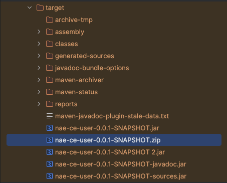
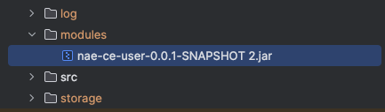

# Modules

We can load modules to the application implemented in Java programming language. To achive
this we need a JAR of module built with *NAE Module Maven Plugin*. This can be done with following
next steps:
1. In your Maven project, include dependency for *NAE Application Engine* with provided scope in your ``pom.xml``

```xml
<dependency>
    <groupId>com.netgrif</groupId>
    <artifactId>application-engine</artifactId>
    <version>7.0.0-SNAPSHOT</version>
    <scope>provided</scope>
</dependency>
```
You do not need to use this dependency for anything, just have it as dependency in your ``pom.xml``.
2. Include the *NAE Module Maven Plugin* in your ``pom.xml`` as plugin.
```xml
<plugin>
    <groupId>com.netgrif.maven</groupId>
    <artifactId>nae-module-maven-plugin</artifactId>
    <version>1.0.0</version>
    <configuration>
        <hostApp>
            <groupId>com.netgrif</groupId>
            <artifactId>application-engine</artifactId>
            <version>7.0.0-SNAPSHOT</version>
        </hostApp>
        <singleOutput>true</singleOutput>
        <excludes>
            <exclude>*log4j</exclude>
            <exclude>*logback*</exclude>
        </excludes>
    </configuration>
    <executions>
        <execution>
            <id>build-module</id>
            <goals>
                <goal>build</goal>
            </goals>
        </execution>
    </executions>
</plugin>
```
4. Run ``mvn clean compile package install``
5. In your ``target`` folder you can see a generated ZIP file

6. Copy and place, then unzip this ZIP file into your ``modules`` folder of your NAE project. This ZIP may contain additional
``lib`` folder, that contains additional dependencies needed for project, but it is only optional.


7. You can test it locally using ``org.springframework.boot.loader.launch.PropertiesLauncher.run()`` with ``ACTIVE_PROFILE=dev`` environment