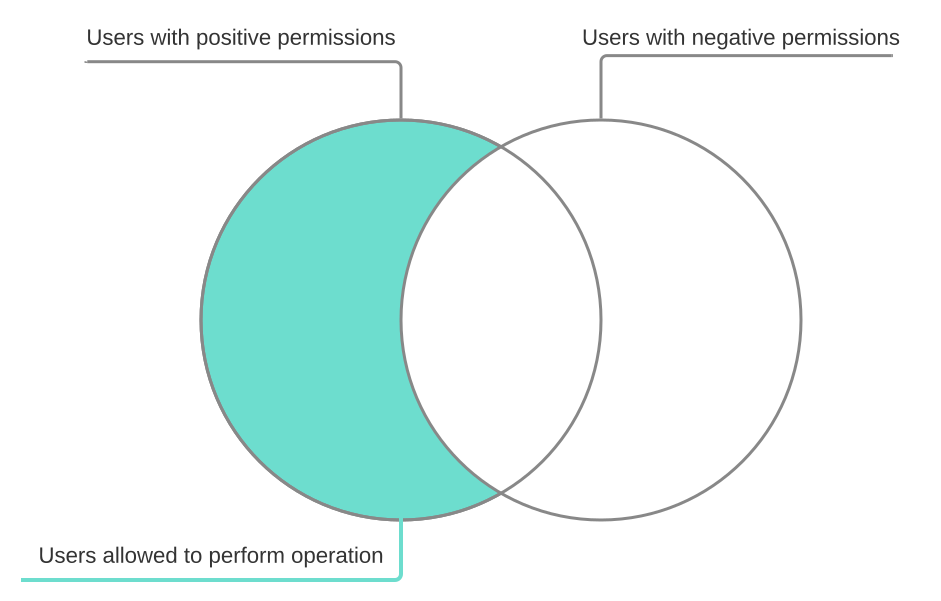

# Negative Permissions

The negative permissions can be used to **exclude** or **prevent** a specific group of users from performing some operation in the application engine.

Negative permissions can be used with both roles and user lists, and are defined by using the _false_ value instead of the more common _true_ value when granting permissions.

Negative roles are _stronger_ than positive roles. We can say that positive roles grant permissions, while negative roles revoke them.
If the user has multiple sources that grant them the permission to perform some operation, but have at least one source that forbids/revokes it then they are not granted the permission.
A visualisation of this can be seen on the Ven diagram bellow.



If the default role is enabled and only a negative permission association is provided, then all the users that are not members of the negatively associated role, or user list,
are permitted to perform the operation. That is negative permissions don't remove the default role unlike positive permissions.

An example for restricting the create permission by a role can be sen bellow:

```xml
<roleRef>
        <id>student</id>
        <caseLogic>
            <create>false</create>
        </caseLogic>
</roleRef>
```

This can be used to (for example) limit the number of instances a single user can create from a specific process.
By adding the user to the role in the post-create event they will only be able to create a single instance of the process.

## AssignedUserPolicy

This option determines if the assigned user can reassign or cancel their assigned task.
It can be defined on the transition as follows:

```xml
<assignedUser>
            <cancel>false</cancel>
            <reassign>false</reassign>
</assignedUser>
```

If there is no assigned user policy, the engine behaves the same as normal.
