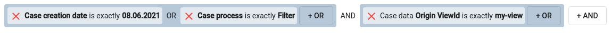
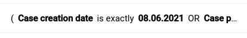
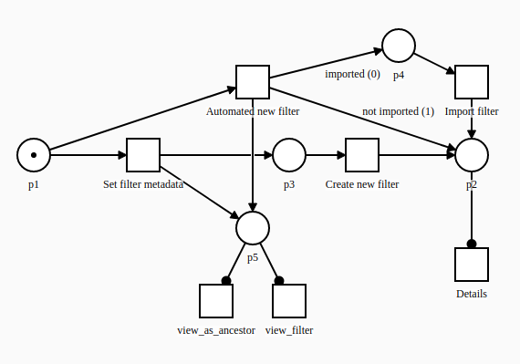

# Developers guide to the Filter process

This document contains information about the Filter process and the API provided by the application engine for
interacting with the instances of the Filter process.

## Filter data variable

This data variable stores a
generated [elastic query string query](https://www.elastic.co/guide/en/elasticsearch/reference/6.6/query-dsl-query-string-query.html)
as it’s value.

It has two additional properties that store the metadata necessary for the reconstruction of a filter.

* _**allowedNets**_ - similar to the case ref data variable type, a list of identifiers of “allowed nets“ is stored in
  the filter field. The stored nets represent the nets that can be used to construct search queries within the advanced
  search component.
* _**filterMetadata**_ - data necessary for reconstructing the state of the advanced search component. The backend
  currently does not provide any utility methods for construction of the metadata object. An interface for this object
  can be found in
  the [documentation](https://developer.netgrif.com/projects/engine-frontend/5.4.1/nae/docs/interfaces/FilterMetadata.html)
  .

Beware that while a filter field does not throw an error when displayed in editable mode and changes can be made to its
frontend representation, these changes are not propagated to backend and do not fire a set data event on the field.
Because of this we recommend only using filter fields in visible mode, to display their values set by the frontend
filter API.

Neither title nor any other meta attribute of the filter field (such as description) is displayed as part of the filter
field component.



*an editable filter field*


*a visible filter field*



*an immediate filter field displayed on a panel*

## Filter process

The engine filter process is located under `resources/petriNets/engine-processes/filter.xml`



The process is relatively simple. It stores and makes accessible the data necessary for the persistence of filters
created by users of the application engine. All the process logic, the model contains is focussed solely on the creation
process of the filter before it reaches its "initialized" state denoted by `p2`.

The process can be overridden by the developers, by placing a net with the same file name and identifier into the
location specified above. The process defines a “process interface” that must remain unchanged when overriding the
process for the frontend APIs that connects to the process to work correctly. Attributes of the process that are part of
the “process interface“ and must remain unchanged will be highlighted.

### Filter process interface

#### Data variables

##### Filter

```xml
<data type="filter" immediate="true">
  <id>filter</id>
  <title name="filter_field">Filter</title>
</data>
```

This field contains the saved filter.

It must be `immediate`, have the ID `filter` and be of type `filter`.

##### Filter type

```xml
<data type="enumeration_map" immediate="true">
  <id>filter_type</id>
  <title name="filter_type">Filter type</title>
  <options>
    <option key="Case" name="filter_type_case">Case filter</option>
    <option key="Task" name="filter_type_task">Task filter</option>
  </options>
</data>
```

This data variable stores the type of the filter stored in the filter field of the filter process. The keys are used for
filtering of the filter processes.

It must be `immediate`, have the ID `filter_type` and be of type `enumeration_map`. The available options must have the
keys `Case` and `Task`. The values associated with these keys are not specified by the Filter process interface and can
therefore be freely overridden.

##### Filter visibility

```xml
<data type="enumeration_map" immediate="true">
  <id>visibility</id>
  <title name="filter_visibility">Filter visibility</title>
  <options>
    <option key="public" name="filter_visibility_public">Public</option>
    <option key="private" name="filter_visibility_private">Private</option>
  </options>
  <init>public</init>
</data>
```

This data variable can be used for filtering of the filter processes based on some internal rules. The application
engine queries this variable when listing filter during navigation menu customisation and during filter export. Only
public and private filters authored by the logged user are offered as options during these selection processes.

No universal restriction is applied to the search queries on these instances, however. The developer must ensure that no
inappropriate filters become available to the user during any search at their own discretion. The queries used by the
application engine can be overridden, by extending the `IUserFiltersSearchService` interface.

It must be `immediate`, have the ID `visibility` and be of type `enumeration_map`. The available options must have the
keys `public` and `private`. The values associated with these keys are not specified by the Filter process interface and
can therefore be freely overridden.

##### Origin ViewId

```xml
<data type="text" immediate="true">
  <id>origin_view_id</id>
  <title name="origin_view_id">Origin ViewId</title>
</data>
```

The viewId of the view where the filter was created is stored in this data variable.
Is only set if the filter originates from a view with an in-app filter.

When the field is set an action is triggered, that resolves the parent filter (if any) and populates the data variables
that are responsible for displaying the parent filter with the appropriate values.

It must be `immediate`, have the ID `origin_view_id` and be of type `text`.

##### Parent filter Id

```xml
<data type="text" immediate="true">
  <id>parent_filter_id</id>
  <title name="parent_filter_id">parent filter ID</title>
</data>
```

The case ID of the parent filter case (if any). Is only set if the filter originates from a different filter case (usually via configurable menu).

When the field is set an action is triggered, that resolves the parent filter (if any) and populates the data variables
that are responsible for displaying the parent filter with the appropriate values.

It must have the ID `parent_filter_id` and be of type `text`.

##### Filter name

```xml
<data type="text">
  <id>new_title</id>
  <title name="filter_name">Filter name</title>
</data>
```

This data variable is used to change the title of the newly created filter case according to the wishes of the user.

The Filter process interface does not specify any restrictions for this data variable, it can be freely overridden or
omitted.

##### I18n filter name

```xml
<data type="enumeration" immediate="true">
  <id>i18n_filter_name</id>
  <title></title>
</data>
```

Contains the name of the filter with locale specific translations. Its value is used to generate configurable group
navigation menu entry titles.

It must be `immediate`, have the ID `i18n_filter_name` and be of type `enumeration`.

The previously mentioned `new_title` data variable has a set action, that pushes its value into this variable. Since
the `new_title` variable is a plain text field, a `I18nString` object with only its default value set is put into this
variable. This field however does support translations, so localised menu entries can be created, or their names changed
trough actions.

##### Filter case id

```xml
<data type="text">
  <id>filter_case_id</id>
  <title></title>
</data>
```

This variable is set during the case creation and stores the ID of this case. Since the frontend integration accesses
the filter process mostly trough tasks, this field can be referenced in any of those tasks to grant direct access to the
case ID, without having to execute an extra search query. The frontend integration does not use this variable currently,
but it can be used in custom integrations.

The Filter process interface does not specify any restrictions for this data variable, it can be freely overridden or
omitted.

##### And me

```xml
<data type="button">
  <id>and_me</id>
  <placeholder name="and">AND</placeholder>
</data>
```

Stores the translated text of the word "AND" in order to create a visual representation of the true filter content. More
information about this can be found in the transition section.

The Filter process interface does not specify any restrictions for this data variable, it can be freely overridden or
omitted.

##### And view

```xml
<data type="button">
  <id>and_view</id>
  <placeholder name="and">AND</placeholder>
</data>
```

Similarly to the `and_me` data variable, this too stores the translated text of the word "AND" in order to create a
visual representation of the true filter content.

This variable is referenced in the action associated with the `origin_view_id` data variable and on the `view_filter`
and `view_as_ancestor` transitions. If it were to be removed this must be taken into the account.

The Filter process interface does not specify any restrictions for this data variable, it can be freely overridden or
omitted.

##### Parent filter task ref

```xml
<data type="taskRef">
  <id>taskref_and_parent</id>
  <title></title>
</data>
```

Similarly to the `and_view` data variable, this too is used to create the visual representation of the true filter
content, because it stores a reference to the task in the parent filter process that contains the true visualisation of
the parent filter.

Just like the `and_view` data variable, this too is referenced in the action associated with the `origin_view_id` data
variable and on the `t1` and `t2` transitions. If it were to be removed this must be taken into the account.

The Filter process interface does not specify any restrictions for this data variable, it can be freely overridden or
omitted.

##### Trimmed origin view id

```xml
<data type="text">
  <id>trimmed_origin_view_id</id>
  <title name="filter_from_view_id">Filter from view with ID</title>
</data>
```

Similarly to the `and_view` data variable, this too is used to create the visual representation of the true filter
content, because it stores a trimmed version of the origin view id, that does not contain any tabbed view identifiers.

Just like the `and_view` data variable, this too is referenced in the action associated with the `origin_view_id` data
variable and on the `t1` and `t2` transitions. If it were to be removed this must be taken into the account.

The Filter process interface does not specify any restrictions for this data variable, it can be freely overridden or
omitted.

##### Is imported

```xml
<data type="number">
  <id>is_imported</id>
  <title></title>
  <init>0</init>
</data>
```

This is the reference value for variable arc to decide, if the filter is imported by the Import filter process or is
automatically created by the backend. When set, it sets the value of the `is_not_imported` data variable to `0`.

It must have the ID `is_imported`, be of type `number` and have the initial value `0`.

##### Is not imported

```xml
<data type="number">
  <id>is_not_imported</id>
  <title></title>
  <init>1</init>
</data>
```

This is the reference value for the alternative variable arc to decide, if the filter is imported by the Import filter
process or is automatically created by the backend.

It must have the ID `is_not_imported`, be of type `number` and have the initial value `1`.

##### Missing allowed nets

```xml
<data type="text">
  <id>missing_allowed_nets</id>
  <title name="missing_allowed_nets">Missing processes</title>
  <desc name="missing_allowed_nets_desc">List of missing processes for current filter</desc>
  <component>
    <name>htmltextarea</name>
  </component>
</data>
```

The purpose of this textarea is to show the list of missing allowed nets for the current (imported) filter. It is
displayed in `import_filters` transition while importing new filter from XML.

It must have the ID `missing_allowed_nets`, be of type `text` and have the component `htmltextarea`.

##### Missing nets translations

```xml
<data type="enumeration_map">
  <id>missing_nets_translation</id>
  <title></title>
  <options>
    <option key="sk">Zoznam chýbajúcich procesov pre aktuálny filter:</option>
    <option key="en">List of missing processes for current filter:</option>
    <option key="de">Liste der fehlenden Prozesse für den aktuellen Filter:</option>
  </options>
</data>
```

The purpose of this map filed is to translate the message in the `missing_allowed_nets` HTML textarea, because the
message in the textarea is dynamically generated depending on the active locale.

It must have the ID `missing_nets_translation` and be of type `enumeration_map`.

##### My full filter

```xml
<data type="taskRef">
  <id>my_full_filter</id>
  <title></title>
</data>
```

This task ref holds a reference to the view_filter transition and is displayed in all tasks that should show the contents of the saved filter.

It is not referenced by anything outside the process, so it can be freely modified, provided all the internal references are compatible. 

#### Functions

##### initializeMyFullFilterTaskRef

```xml
<function scope="process" name="initializeMyFullFilterTaskRef">
    {
        com.netgrif.application.engine.petrinet.domain.dataset.TaskField myFullFilter
    ->
        change myFullFilter value {return [findTask({it.caseId.eq(useCase.stringId).and(it.transitionId.eq("view_filter"))}).stringId]}
    }
</function>
```

This utility process-scoped function is used to set the value of the `my_full_filter` task ref data variable.

It is called in a finish-post action of both the `frontend_create` and `auto_create` transitions,
since their execution makes the searched transition (`view_filter`) executable.

#### Roles

##### System

The system role is used to hide the `view_filter` and `view_as_ancestor` tasks from the user.

The other transitions executed by the system are never searched for by the frontend API and therefore don't need to have this role assigned to them.

#### Transitions

The net consists of seven transitions. **Set filter metadata** and **create new filter** are used when creating filter
from frontend filter API.
**Automated new** is used, when creating filter from backend automatically. **Import filter** transition is used when
importing filters in the
_import\_filters_ process. The last three transitions **Details**, **View filter** and **View as ancestor** are used to
display filter preview.

##### Set filter metadata

```xml
<transition>
  <id>frontend_create</id>
  <label>Set filter metadata</label>
  <dataGroup>
    <dataRef>
      <id>filter</id>
      <logic>
        <behavior>editable</behavior>
      </logic>
    </dataRef>
    <dataRef>
      <id>filter_type</id>
      <logic>
        <behavior>editable</behavior>
      </logic>
    </dataRef>
    <dataRef>
      <id>origin_view_id</id>
      <logic>
        <behavior>editable</behavior>
      </logic>
    </dataRef>
  </dataGroup>
</transition>
```

This transition is executed automatically by the frontend filter API in order to set the necessary filter data into the
process instance, when a new filter is created (saved).

It must have the transition ID `frontend_create`.

It must contain 4 data fields that are set via an API request:

* `filter`
* `filter_type`
* `origin_view_id`
* `parent_filter_id`

Custom set data requests can be sent via the frontend filter API. These requests target this task. Therefore, if you
want to set additional properties to your newly created filter instances you can do so by adding the necessary data
variables to this task and then use the frontend API to set their values.

Once it finishes the `view_filter` and `view_as_ancestor` tasks become executable.
An action is bound to the finish of this transition, that sets the reference of the `my_full_filter` task ref.

##### Create new filter

```xml
<transition>
  <id>newFilter</id>
  <assignPolicy>auto</assignPolicy>
  <label name="create_new_filter">Create new filter</label>
  <dataGroup>
    <dataRef>
      <id>my_full_filter</id>
      <logic>
        <behavior>visible</behavior>
      </logic>
    </dataRef>
  </dataGroup>
  <dataGroup>
    <dataRef>
      <id>visibility</id>
      <logic>
        <behavior>editable</behavior>
        <behavior>required</behavior>
      </logic>
    </dataRef>
    <dataRef>
      <id>new_title</id>
      <logic>
        <behavior>editable</behavior>
        <behavior>required</behavior>
      </logic>
    </dataRef>
  </dataGroup>
</transition>
```

This transition is displayed to the user in the side menu when a new filter case instance is created (a filter is saved)
through the frontend filter API.

It can reference any filter data variables. The default implementation references, the filter and its type in visible
mode (they were set in the previous step), an editable visibility choice and an editable text field for setting the new
filter case title (via a finish action).

It must have the transition ID `newFilter`.

##### Automated new filter

```xml
<transition>
  <id>auto_create</id>
  <label>Automated new filter</label>
  <dataGroup>
    <dataRef>
      <id>filter</id>
      <logic>
        <behavior>editable</behavior>
      </logic>
    </dataRef>
    <dataRef>
      <id>filter_type</id>
      <logic>
        <behavior>editable</behavior>
      </logic>
    </dataRef>
    <dataRef>
      <id>visibility</id>
      <logic>
        <behavior>editable</behavior>
      </logic>
    </dataRef>
    <dataRef>
      <id>origin_view_id</id>
      <logic>
        <behavior>editable</behavior>
      </logic>
    </dataRef>
  </dataGroup>
</transition>
```

This transition is executed by the `DefaultFiltersRunner`, in order to set the data present in the previous two
transitions with a single `setData` operation.

It must have the transition ID `auto_create`.

It must contain 5 data fields that are set via a `setData` API call.

* `filter`
* `filter_type`
* `origin_view_id`
* `parent_filter_id`
* `visibility`

Once it finishes the `view_filter` and `view_as_ancestor` tasks become executable.
An action is bound to the finish of this transition, that sets the reference of the `my_full_filter` task ref.

##### Import filter

```xml
<transition>
  <id>import_filter</id>
  <label name="import_filter">Import filter</label>
  <dataGroup>
    <dataRef>
      <id>new_title</id>
      <logic>
        <behavior>editable</behavior>
      </logic>
    </dataRef>
    <dataRef>
      <id>filter_type</id>
      <logic>
        <behavior>visible</behavior>
      </logic>
    </dataRef>
    <dataRef>
      <id>visibility</id>
      <logic>
        <behavior>editable</behavior>
      </logic>
    </dataRef>
    <dataRef>
      <id>missing_allowed_nets</id>
      <logic>
        <behavior>hidden</behavior>
      </logic>
    </dataRef>
  </dataGroup>
  <dataGroup>
    <dataRef>
      <id>my_full_filter</id>
      <logic>
        <behavior>visible</behavior>
      </logic>
    </dataRef> 
  </dataGroup>
</transition>
```

This transition is used in the `import_filters` process to allow editing of filter name and filter visibility when
importing a new filter.

It must have the transition ID `import_filter`.

It should contain at least these data fields to display to the user which filter is being imported and allow them to
change some fundamental filter properties:

* `new_title` (editable)
* `filter_type` (visible)
* `visibility` (editable)
* `my_full_filter` (visible)
* `missing_allowed_nets` (hidden) - made visible by the import action if some nets are missing

##### Details

```xml
<transition>
  <id>t2</id>
  <label name="details">Details</label>
  <dataGroup>
    <dataRef>
      <id>filter</id>
      <logic>
        <behavior>visible</behavior>
      </logic>
    </dataRef>
    <dataRef>
      <id>filter_type</id>
      <logic>
        <behavior>visible</behavior>
      </logic>
    </dataRef>
    <dataRef>
      <id>visibility</id>
      <logic>
        <behavior>visible</behavior>
      </logic>
    </dataRef>
  </dataGroup>
</transition>
```

This transition makes the filter metadata accessible to the users of the application.

The Filter process interface does not specify any restrictions for this data variable, it can be freely overridden or
omitted. Beware however, that it is referenced by the `origin_view_id` actions. This must be taken into the account when
omitting this transition.

##### View filter

```xml
<transition>
  <id>view_filter</id>
  <label></label>
  <dataGroup>
    <dataRef>
      <id>filter</id>
      <logic>
        <behavior>visible</behavior>
      </logic>
    </dataRef>
    <dataRef>
      <id>filter_case_id</id>
      <logic>
        <behavior>hidden</behavior>
      </logic>
    </dataRef>
    <dataRef>
      <id>origin_view_id</id>
      <logic>
        <behavior>forbidden</behavior>
      </logic>
    </dataRef>
    <dataRef>
      <id>taskref_and_parent</id>
      <logic>
        <behavior>visible</behavior>
      </logic>
    </dataRef>
  </dataGroup>
  <dataGroup>
    <id>DataGroup_1</id>
    <layout>grid</layout>
    <dataRef>
      <id>and_view</id>
      <logic>
        <behavior>forbidden</behavior>
      </logic>
    </dataRef>
    <dataRef>
      <id>trimmed_origin_view_id</id>
      <logic>
        <behavior>forbidden</behavior>
      </logic>
    </dataRef>
  </dataGroup>
</transition>
```

This transition displays the true content of the filter represented by the process. It can be task-reffed to show a
referenced filter somewhere (such as in the configurable group navigation entries and filter previews). In addition to
the filter field itself the ancestor filters are displayed here as well. Each of them is prefixed with an AND text to
indicate that they are combined with the original filter with the **and** operator.

If the root of the filter chain is a filter process (indicated by its `parent_filter_id` having a non-empty value)
the root filters content will be the last entry displayed. If the root is a frontend filter
(indicated by its `origin_view_id` field being set to a non-empty string) the last entry will
contain a text indicating the view from which the filter originates. The displayed view ID excludes any tab suffixes.

If the filter does not originate from a view its `origin_view_id` field must have its behavior set to `forbidden`, 
so that the frontend parsing mechanism won't find false positives during the interpretation of the filter.

It must have the transition ID `view_filter`.

It must contain 1 data field:

* `filter`

##### View as ancestor

```xml
<transition>
  <id>view_as_ancestor</id>
  <label></label>
  <dataGroup>
    <dataRef>
      <id>and_me</id>
      <logic>
        <behavior>visible</behavior>
      </logic>
    </dataRef>
    <dataRef>
      <id>filter</id>
      <logic>
        <behavior>visible</behavior>
      </logic>
    </dataRef>
    <dataRef>
      <id>taskref_and_parent</id>
      <logic>
        <behavior>visible</behavior>
      </logic>
    </dataRef>
  </dataGroup>
  <dataGroup>
    <id>DataGroup_1</id>
    <layout>grid</layout>
    <dataRef>
      <id>and_view</id>
      <logic>
        <behavior>forbidden</behavior>
      </logic>
    </dataRef>
    <dataRef>
      <id>trimmed_origin_view_id</id>
      <logic>
        <behavior>forbidden</behavior>
      </logic>
    </dataRef>
  </dataGroup>
</transition>
```

Contains the same information as the View filter task, but every row is prefixed with an AND text (including the first
row that contains the filter field of this case).

This task is referenced when resolving ancestor filters from the immediate children of this filter.

## Backend filter API

Since filters are implemented as Petriflow processes, they share the same API with any other process. The old filter
related services, controllers and other classes have been deprecated in the 5.4.0 release and should no longer be used.

There are a few things to keep in mind when working with filters.

### Using filter fields for filtering of cases and tasks

You can use the value and other attributes of a filter field to create database queries.

When doing so, make sure to check if the filter has the appropriate type (that is only use Case filters to filter cases
and Task filters to filter tasks).

The value attribute of a filter field is
an [elastic query string query](https://www.elastic.co/guide/en/elasticsearch/reference/6.6/query-dsl-query-string-query.html) (
as mentioned above) and therefore cannot be used to filter entries from the Mongo database. It can however be turned
into a `CaseSearchRequest` class instance, by populating the `query` attribute with the filter field value. This object
can then be passed to the `ElasticCaseService` to find the cases that match the query. If you want to search for task
instances then analogous classes and services exist.

### Actions API

Filter fields have only a limited support in the actions API.

Only their value can be changed with the `change` action and this change is NOT propagated to the other filter field
attributes (allowedNets and filterMetadata). Since these two attributes are the important part when restoring an
advanced search component state on the frontend it can easily lead to “desynchronisation“ of these values. Changing
these values should therefore be done cautiously.

### Set data method

The set data method of the `TaskDataService` can be used to modify all the attributes of a filter field. All of them
must be set at the same time, any missing attributes will have its value set to `null`.

### DefaultFiltersRunner

This runner contains utility methods that can be used to create default system filter process instances. The author of
these filters will be the system user.

## Frontend filter API

Since saved filters are cases you should use the existing API for interacting with cases. Utility methods exist for some
operations. You should keep in mind however that, the frontend library does not provide a full filter persistence and
management implementation, only the building blocks for creating one, therefore you must implement it on your own
according to your wishes. An overview of these building blocks can be found in the following sections.

### Filter constants

The
enum [UserFilterConstants](https://developer.netgrif.com/projects/engine-frontend/latest/nae/docs/miscellaneous/enumerations.html#UserFilterConstants)
contains identifiers and IDs of all parts of the filter process referenced by the frontend filters API.

### UserFiltersService

The [UserFiltersService](https://developer.netgrif.com/projects/engine-frontend/latest/nae/docs/injectables/UserFiltersService.html)
contains the API for saving, loading and deleting filter process instances.

The search component contains buttons that trigger the save and load methods, so you do not have to use this service
directly, but if you wish to create your own user interface you can re-use the implementation provided by this service.

Injection tokens are available for the configuration of the side menu components used to save and load
filters (`NAE_SAVE_FILTER_COMPONENT` and `NAE_LOAD_FILTER_COMPONENT`). An injection token is also available for
configuring the filter that filters the filter process instances displayed when loading a filter (`NAE_FILTERS_FILTER`).

### SearchComponent

The [SearchComponent](https://developer.netgrif.com/projects/engine-frontend/latest/nae/docs/classes/AbstractSearchComponent.html)
is a wrapper for the two search mode components (fulltext and advanced)
these components can be used independently of each other and the search component combines them into one and adds
various control elements to them.

The search component has two outputs - `filterLoaded` and `filterSaved`. These emit data related to either the saved
filter, or the selected filter in the load pop-up. The developers must process these outputs in order to implement fully
functional filter management.

The component also has na input - `additionalFilterData`. This input can be used to modify the content of the set data
request that is sent by the `UserFiltersService`, when a new filter is created. This way a less invasive option is
available when overriding the default filter process and adding additional metadata necessary for your implementation of
filter management.

An injection token is available for the configuration of the search component - `NAE_SEARCH_COMPONENT_CONFIGURATION`. It
provides
a [SearchComponentConfiguration](https://developer.netgrif.com/projects/engine-frontend/latest/nae/docs/interfaces/SearchComponentConfiguration.html)
object that can be used to hide many elements of the search component (buttons mostly). This way you can remove the save
and/or load filter buttons and therefore not allow the users to persist filters in some specific views.

### SearchService

The [SearchService](https://developer.netgrif.com/projects/engine-frontend/latest/nae/docs/injectables/SearchService.html)
provides two complementary methods - `createPredicateMetadata` and `loadFromMetadata`. These can be used to populate the
search service with a predicate stored inside a filter field (`filterMetadata` attribute). If an advanced search
component is connected to the search service, then it will automatically display the loaded predicate.

### FilterExtractionService

The [FilterExtractionService](https://developer.netgrif.com/projects/engine-frontend/latest/nae/docs/injectables/FilterExtractionService.html)
contains the functionality of extracting a frontend [Filter](https://developer.netgrif.com/projects/engine-frontend/latest/nae/docs/classes/Filter.html)
instance from the data of a configurable navigation entry task.