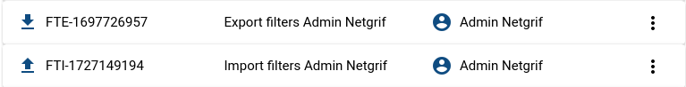
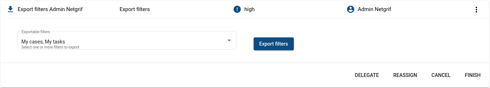
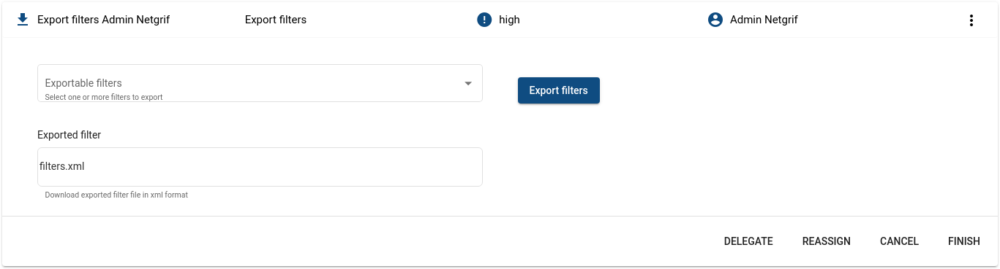
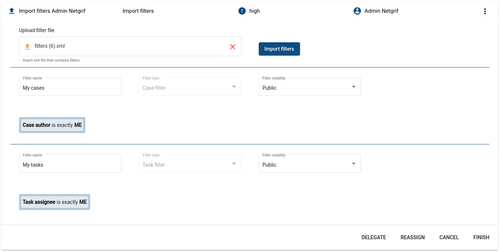
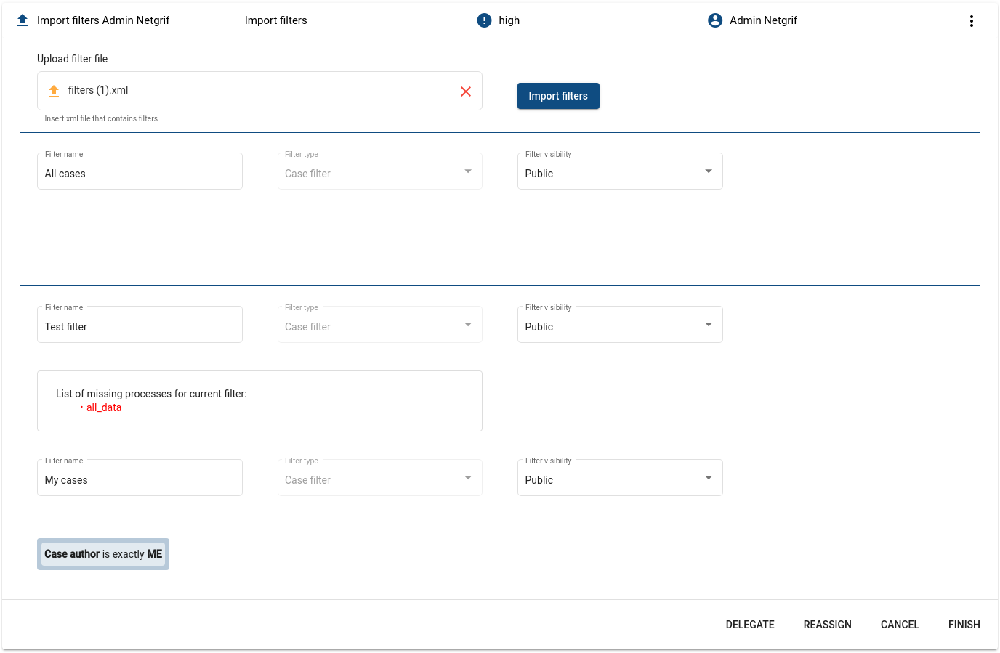

# Filter import/export

## User guide

This guide is aimed at application users that wish to know, how to import/export selected filters from/to application.
If you are developer that wishes to know more about the implementation and various ways the system can be interacted
with, you can find this information in the Developer guide of filter import/export.

### Overview

Every user in the application have option to import/export filters. For every user in application case for import
filters and also case for export filters exists as shown on the next image.

### Processes

#### Export filters

After user opens **Export filters USERNAME** case, task to export filters is displayed. The task consists of three
fields, from which only two are initially displayed to user.

First field is multi choice field, which allows user to select multiple filters, which he wants to export. Filters that
are displayed in this multi choice are all **public** filters in the application (filters which can be created by other
users) and also all **private** filters of currently logged user. After user selects filters which he wants to export
and clicks on the **Export filters** button, the third field is displayed.

This field holds exported xml file, which contains exported filters in the custom xml format. User can download this
file by clicking on its name. This file can be later used to import filters into the application. Users should never
create or modify these files on their own, because of the complexity of filters format inside xml file.

#### Import filters

After user opens **Import filters USERNAME** case, task to import filters is displayed. The task consists of two fields,
which are initially displayed to user and after these two fields there is one section for every imported filter.

First field is file field, where user should upload xml file, that contains exported filters. After user uploads this
xml file and clicks on **Import filters** button, application validate uploaded file against schema, which doesn't allow
upload of files in incorrect format. If format of uploaded file is correct, application initialize creation of filters
and displays these filters under initially displayed fields.

Each section after horizontal line represents one imported filter. User can change two properties for each imported
filter. First one is filter name and the second one is visibility of the filter. User can also see type of the filter (
if the filter is for tasks or for cases) and also filter preview, so he can know what it is filtering.

In some situation, imported filter have dependency on some processes. To correctly display preview of filter and further
correct function of filter, all these processes need to be uploaded in application. If some of these processes are
missing, list of missing processes is displayed inside textarea as shown on next image.

When user is satisfied with imported filters, their names and visibility, he can confirm creation of these filters by
pressing **FINISH** button on the bottom right. If the imported filters are not according to his ideas, he can abort
further creation of these filters by pressing **CANCEL** button or deleting uploaded xml file from file field.

## Developer guide

This guide is aimed at developers that wish to know the implementation detail of filter import/export, so they can
interact with or override its implementation. If you are application user and wish to know how to use the options
available to you read the User guide of filter import/export. Please read **Filter process guide** before u start
reading this one, because of some references on this process.

### Overview

The filter import and export consists of two processes, which are independent of each other. Names of processes are
self-explaining:

- **Export of filters** - serves for export of filters into xml file `export_filters.xml`
- **Import of filters** - serves for import of filters from xml file `import_filters.xml`

New schema, which describes format of xml file for exported filters, were introduced
`filter_export_schema.xml`. All imported xml files containing filters are validated against this schema to ensure
filters will be correctly created and working. Also, new exception class for incorrect xml file format of imported
filters was created to throw error after validating xml file against schema `IllegalFilterFileException`.

Multiple classes were added to support serialization and deserialization of filters. These classes are:

- Configuration
- FilterImportExport
- FilterImportExportList
- FilterMetadataExport
- Predicate
- PredicateArray
- PredicateValue
- CustomFilterDeserializer

`ActionDelegate` have two new functions, which support filters import/export:
`exportFilters(Collection<String> filtersToExport)` and `importFilters()`. Also, new service `FilterImportExportService`
which is called by these two functions was created and which performs most functionality in importing and exporting
functions.

When creating new user, case for importing filters and also case for exporting filters is created for this user.

Also, new property was added into `application.properties`, with name `nae.filter.export.file-name`, which defines name
of xml file that contains exported filters. This property has default string value of **filters.xml**.

When filters are exported, all of their ancestors are exported as well. If the exported filters have common ancestors,
the ancestors are only exported once. The relationships between filters are reconstructed on import based on the
exported filters case Ids. It is assumed that parents precede their children in the imported file
(the exported file is generated in this way). If a filter cannot find its parent on import the connection will
be severed and an error will be logged.

### Processes

#### Export filters

Export process consists of one task `exportFilter`, which carry out whole exporting of filters. Process and also the
only task consist of three data fields. First one is `exportable_filters`, which is **multichoice_map** that displays
all filters, that are exportable by currently logged user. List is loaded from `ActionDelegate`
method `findAllFilters()` and returns all filter cases, that are public and created by any user or that are private and
created by currently logged user.

After selecting filters to export and clicking on second data field **button** with id `export_btn`, the
method `exportFilters()` from `ActionDelegate`
is called. This method serialize selected filters into xml file and put this file into third **file** field with
id `export_file`.

Export filters can be run any number of times so the user can export any number of filters in selected combinations into
any number of xml files.

#### Import filters

Import process also consists of one task `importFilter`, which carry out whole importing of filters. There are also just
three data fields in this process. First one is **file** field `upload_file` that serves for upload of xml file with
filters. After uploading this file and clicking on the next **button** field `import_file`, the `importFilters()` method
from `ActionDelegate` is called, that validates uploaded xml file against xsd schema.

- If file is valid, method creates **Filter** cases via **Automated new filter** task and move them into **Import
  filter** task. Method returns list of **Import filter** task ids, that are set as value for **taskRef**
  field `imported_filters`, so the user can update some values of these filters.
- If file is not valid, error message is thrown.

Pressing **FINISH** button in this task moves imported filters into state, where they can be added into group
navigation.

Pressing **CANCEL** button or changing value to `upload_file` deletes created filters, so there will not be unworkable
filters saved in the application database.

As well as export filters, import filters can be run any number of times, so user can upload how many filters as he
wants.
